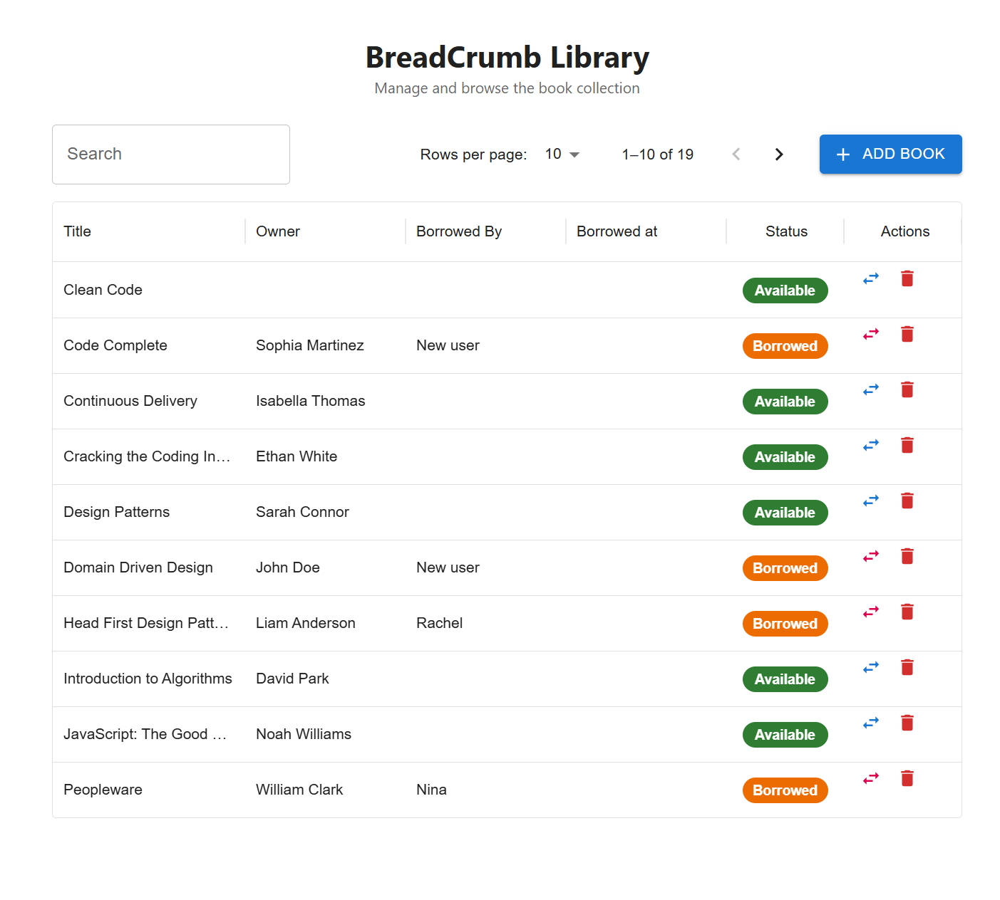
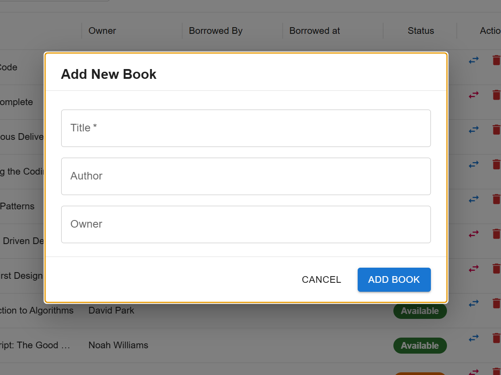

# BreadCrumb Library

A prototype library management app for browsing and managing a book collection.

---

## Architecture Note

Because this is a prototype, the API project follows a simplified structure — the repository, service (business logic), and controller layers all live inside the same `API` project rather than being split into separate projects or layers.

---

## Getting Started

### Start the API

Open the `API` solution in Visual Studio or run from the terminal:

```bash
cd API/API
dotnet run
```

The server starts at:
- HTTP: `http://localhost:5085`
- HTTPS: `https://localhost:7064`

On first run, the server automatically creates the SQLite database (`library.db`) and seeds it with initial data if it does not already exist. No manual database setup is required.

API docs are available at `https://localhost:7064/swagger` when running in Development mode.

### Start the Client

```bash
cd library-client
npm install
npm run dev
```

The client starts at `http://localhost:3000`.

---

## Dependencies

### API (.NET 10)

| Package | Version |
|---|---|
| Microsoft.AspNetCore.OpenApi | 10.0.8 |
| Microsoft.EntityFrameworkCore | 10.0.8 |
| Microsoft.EntityFrameworkCore.Sqlite | 10.0.8 |
| Swashbuckle.AspNetCore | 10.1.7 |

### Client (React + Vite)

| Package | Version |
|---|---|
| react | ^18.3.1 |
| react-dom | ^18.3.1 |
| @mui/material | ^9.0.1 |
| @mui/icons-material | ^9.0.1 |
| @mui/x-data-grid | ^9.3.0 |
| @emotion/react | ^11.14.0 |
| @emotion/styled | ^11.14.1 |
| axios | ^1.16.1 |
| typescript | ~5.6.2 |
| vite | ^5.4.10 |

## UI
Dashboard

Add new book modal



---

## Design Decisions

**Add Book button at the top** — placed in the toolbar alongside search and pagination so it is immediately visible without scrolling.

**Inlcudes author and borrowed by columns** — UI include auhtor and borrowed by column which were not in the sketch. These are important information when demoing. 

**MUI DataGrid for the book table** — used because it provides sorting and filtering out of the box with minimal setup.

**Server-side pagination and search** — the API handles paging and search queries rather than loading all records into the client. This keeps the app performant and scalable as the book collection grows.

**SQLite as the database** — used to mimic real database calls without requiring a database server to be installed or configured. EF Core manages the schema and seed data automatically on startup, so the experience closely reflects how the app would behave against a production database.
